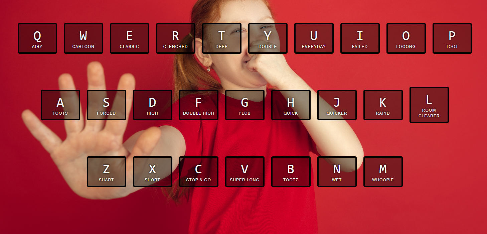

# Sound Machine

A fun keyboard based sound machine that makes fart noises. This was a project done for Wes Bos' 30Days of Javascript. This lesson taught how to manipulate the DOM to change classes within the dom and how to select certain parts within a page.

## How To Use
Press any letter on the keyboard to hear a nice fart sound. The 11 year old spirit in you would be proud!

## Future Improvments
- Add library of music notes, cartoon sounds and video game sounds.
- Add toogle switch.
- Toggle switch would display different themed pages to correspond to different sound libraries.

## Authors and Contributing
This was a project done for the [30 days of javascript site](https://javascript30.com/). It started as a drum machine and I expanded on it as a self study excersie.

Sound effects obtained from https://www.zapsplat.com

Image by macrovector (https://www.freepik.com/free-vector/toxic-smoke-realistic-background_21078166.htm#page=2&query=fart&position=13&from_view=search)

## License
[MIT](https://choosealicense.com/licenses/mit/)

Copyright (c) [2022] [Joseph D'Amato]

Permission is hereby granted, free of charge, to any person obtaining a copy
of this software and associated documentation files (the "Software"), to deal
in the Software without restriction, including without limitation the rights
to use, copy, modify, merge, publish, distribute, sublicense, and/or sell
copies of the Software, and to permit persons to whom the Software is
furnished to do so, subject to the following conditions:

The above copyright notice and this permission notice shall be included in all
copies or substantial portions of the Software.

THE SOFTWARE IS PROVIDED "AS IS", WITHOUT WARRANTY OF ANY KIND, EXPRESS OR
IMPLIED, INCLUDING BUT NOT LIMITED TO THE WARRANTIES OF MERCHANTABILITY,
FITNESS FOR A PARTICULAR PURPOSE AND NONINFRINGEMENT. IN NO EVENT SHALL THE
AUTHORS OR COPYRIGHT HOLDERS BE LIABLE FOR ANY CLAIM, DAMAGES OR OTHER
LIABILITY, WHETHER IN AN ACTION OF CONTRACT, TORT OR OTHERWISE, ARISING FROM,
OUT OF OR IN CONNECTION WITH THE SOFTWARE OR THE USE OR OTHER DEALINGS IN THE
SOFTWARE.

### PS
I laughed the whole time I sat there and committed it to github. 
